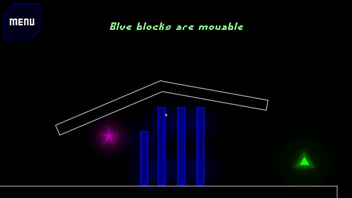

# Ball Bounce Game
A Unity2D game where you launch balls in a physics environment with the goal of reaching a ball to the end tile.

# Build instructions

Project uses experimental 2D lighting from the Universal Render Pipeline

Current editor version is 2021.3.24f1

Depends Universal RP 12.1.11, can be installed with the package manager. 
